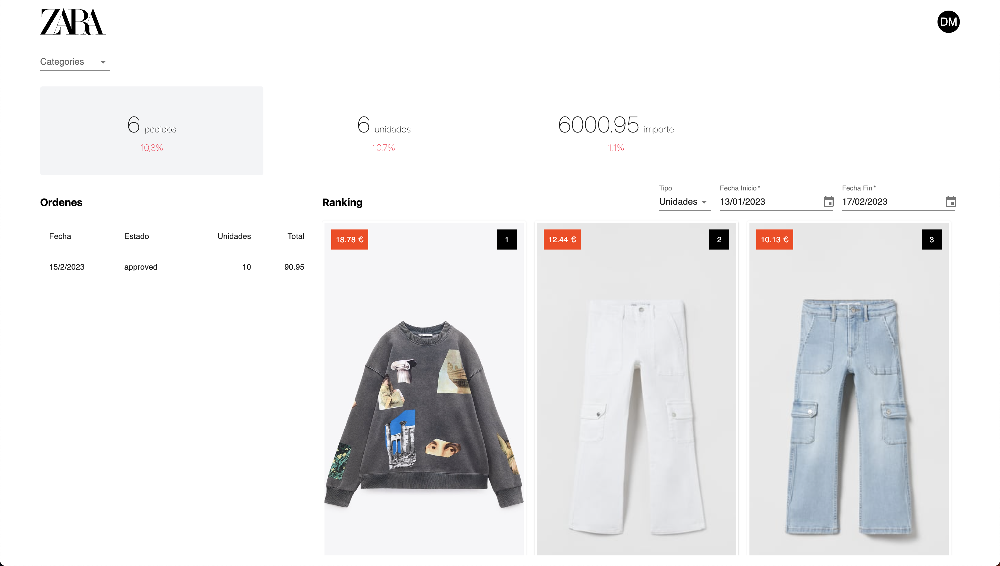

# Requisitos

Para empezar con este proyecto necesitarás los siguientes requisitos previos:

- [NodeJS](https://nodejs.org/en/) - Se recomienda la version >= 18.14.1 (LTS)
- IDE - Se recomienda [VsCode](https://code.visualstudio.com/).
- [Swagger](https://editor.swagger.io/) - Lo utilizaremos para ver la API que tenemos que consultar, utiliza el `api/openapi.yaml` que hay en la raiz del proyecto para visualizar las APIs disponibles.

# Descripción del proyecto

Este proyecto tiene como objetivo crear una aplicación web visualmente atractiva para los usuarios, que les permita visualizar un ranking de prendas, y filtrar por tipo y por fecha, para el desarrrollo se han utilizado las siguiente tecnologías:

- [ReactJS](https://reactjs.org/) - Librería para construir la interfaz
- [Msw](https://mswjs.io/) - Librería que nos ayuda a mockear APIs
- [Vite](https://vitejs.dev/) - Herramienta para contruir el proyecto
- HTML - CSS - JavaScript - Tecnologías fundamentales para la creación de la aplicación web.

# 🚀 ¿Cómo lo ejecuto en local?

Para ejecutar la aplicación en local, sigue los siguiente pasos:

1. Abre una terminal y escribre el siguiente comando para instalar las dependencias:

```shell
npm install
```

2. Ahora, ejecuta el siguiente comando para iniciar la aplicación:

```shell
npm start
```

Puedes también validar los test usando:
```shell
npm run test
```

# 📦 Librería de componentes 

Puedes usar cualquier librería de componentes que esté basada en ReactJS. A continuación se mencionan algunas recomendaciones:

- [Material UI](https://mui.com/)
- [Antd](https://ant.design/)
- [Chakra UI](https://chakra-ui.com/)

O tambien puedes crearte tus propios componentes 😎.

# 🗽 Diseño:



# 💪 Ejercicios

>💡 Antes de comenzar con los ejercicios selecciona una librería de componentes.

### 📝 Nota 
Algunos ejercicios tendrán dentro del código, para guiarte:

```js
// TODO: Ejercicio X --------------
``` 

## Ejercicio 1:

Añadiremos un componente para indicar nuestro avatar en la aplicación dentro del componente `Header`.

## Ejercicio 2:

Crea el componente `Filters`, este componente contendrá un selector con categorías de productos.

Luego cambiaremos el componente `<Filters  />` por el `<Placeholder>` en el fichero `app.jsx` (Tienes TODO 😉).

>💡 Te recomiendo crear una carpeta `/filters` dentro de la carpeta `/components` para crear el componente y utilizarlo dentro del componente App (`app.jsx`).


Enlaza las opciones del selector con los datos de nuestra API, usando el siguiente endpoint:

`/products/categories`

>💡 Te recomiendo utilizar [fetch](https://developer.mozilla.org/en-US/docs/Web/API/Fetch_API/Using_Fetch) para poder consultar a la API


### Ejercicio 3:

Crea el componente `Summary`, en este mostraremos tres tarjetas con las cantidades de `pedidos`, `unidades` e `importe`.

Enlaza las cantidades con la API:

`/report-summary`


### Ejercicio 4:

Crea el componente `Orders`, mostraremos una tabla con el contenido de las órdenes.

Enlaza la tabla con la API:

`/orders`

### Ejercicio 5:

En este ejercicio, deberás crear el componente `Ranking`, que tendrá dos componentes hijos. El primero será una barra de filtros y ordenaciones, y el segundo será el ranking.

#### Ejercicio 5.1:

En la barra del ranking, se mostrará en el lado izquierdo el título `Ranking` y en el lado derecho un selector con estas opciones:

```js
const TYPES = [
    { value: "orders", label: "Ordenes" },
    { value: "units", label: "Unidades" },
    { value: "amount", label: "Total" }
];
```

Además, se incluirán dos `DatePicker` para indicar la fecha inicio y fecha fin para filtrar los datos.

#### Ejercicio 5.2:

Crear un ranking de prendas con tarjetas donde se mostrará la imagen de la prenda, el precio y la posición del ranking.

#### Ejercicio 5.3:

Ahora deberás enlazar el selector y las fechas con la siguiente API para que te devuelva un ranking de prendas:

`/ranking`


>💡 Ten en cuenta que la API mock está preparada solo para los tipos, así que tendrás que modificar el mock para que tengan en cuenta las fechas y validar que llegan con este formato `YYYY/MM/DD`.

### Extra Ejercicio:

Realiza un test de integración que compruebe que al cambiar el selector de tipo y las fechas, se muestre correctamente el ranking.

>💡 Tienes un test de prueba en `components/header` 

>💡 Para comprobar los test utiiza este comando `npm run test`

# 🤔 ¿Donde están los mocks?

En el fichero `mocks/handlers.js`, tendras todos los mocks de cada api que puedas consultar:

- `/products`
- `/products/categories`
- `/report-summary`
- `/orders/:orderId`
- `/orders`
- `/ranking`

# 🥺 Error msw Worker

Si el servidor de desarrollo presenta un error con el MSW, puede ser que no puedas encender el proyecto. Para solucionar este problema, utiliza en la terminal el siguiente comando:

```shell
npm run init:worker:msw
```
